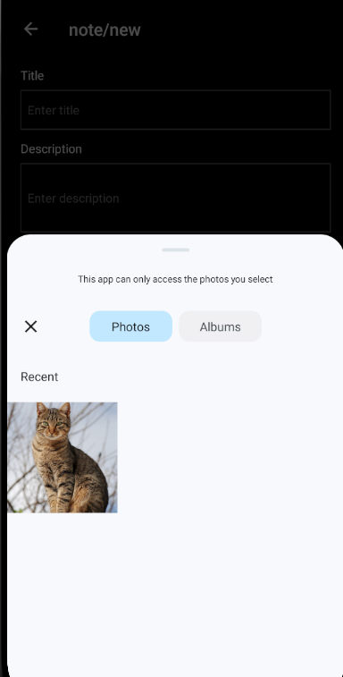
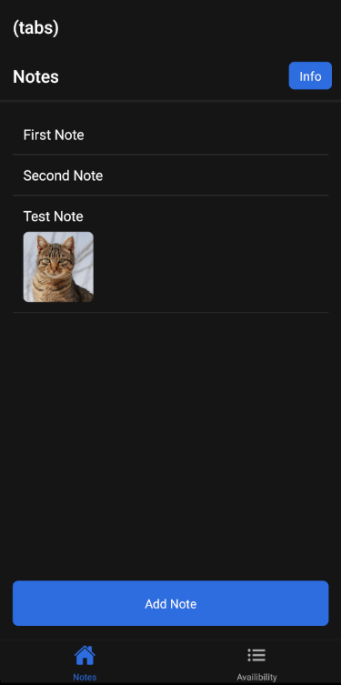
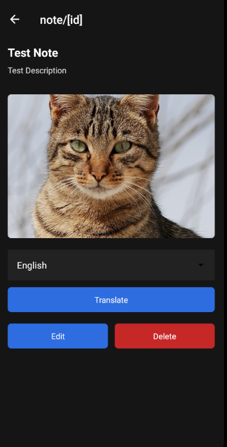
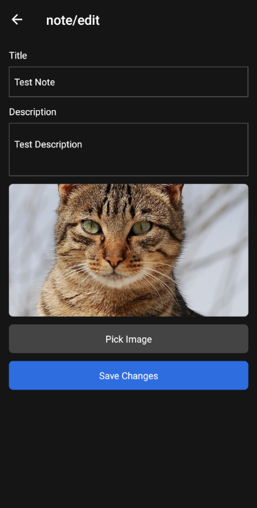
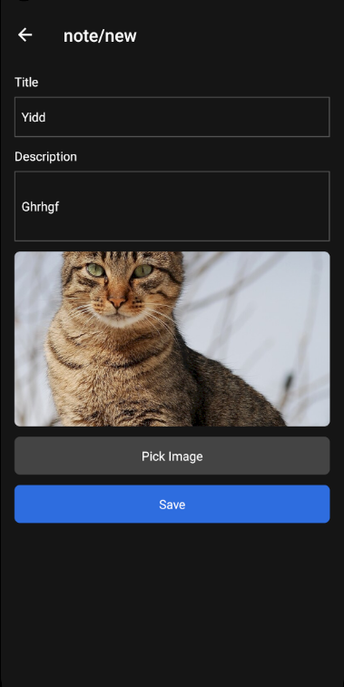
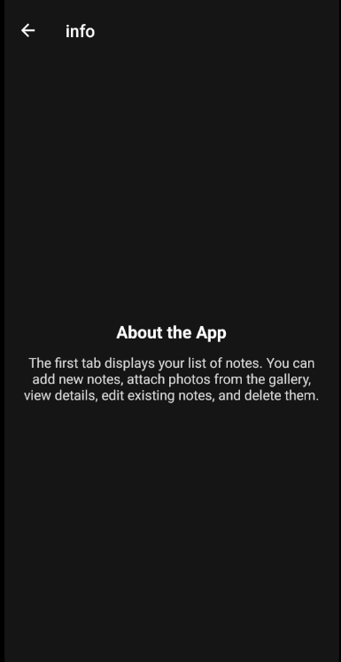

# Field Notes

## Opis
Prosta aplikacja mobilna napisana w **React Native (Expo Router)**.  
Pozwala tworzyć notatki z tytułem, opisem i zdjęciem z galerii.  
Dodatkowo można przetłumaczyć opis notatki przez API LibreTranslate.

## Funkcje
- Lista notatek (tytuł, opis, miniaturka zdjęcia).
- Szczegóły notatki (pełny opis, zdjęcie, przyciski: Edytuj, Usuń, Tłumacz).
- Dodawanie i edycja notatki (formularz + możliwość dodania zdjęcia).
- Info screen z krótkim opisem aplikacji.

## Natywna funkcja
- Wybór zdjęcia z galerii urządzenia (ImagePicker).

## API
- **LibreTranslate** – tłumaczenie opisu notatki na wybrany język.

## Widoki
1. Lista notatek

2. Szczegóły notatki

3. Dodaj / Edytuj notatkę

4. Info

## Jak testować
1. Uruchom aplikację na emulatorze lub urządzeniu. (npx expo run:android)
2. Dodaj nową notatkę (tytuł, opis, zdjęcie).
3. Otwórz notatkę z listy → zobacz szczegóły.
4. Kliknij **Translate** i wybierz język → opis zostanie przetłumaczony.
5. Sprawdź edycję i usuwanie notatek.

## Definition of Done
- [x] 3–4 widoki
- [x] 1 natywna funkcja (galeria)
- [x] Integracja z API (LibreTranslate)
- [x] Czytelny UI
- [x] README z opisem